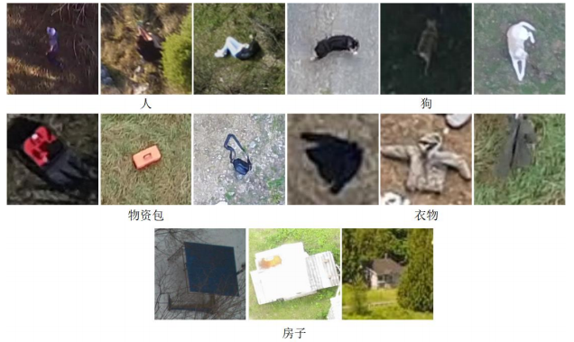

# 源天救援-低空无人机搜救图像数据集（BUU-SARD）

近年来，得益于大量无人机视角图像数据集的出现，以数据驱动的深度学习模式极大推动了无人机视角下目标检测算法的快速发展。目前，现有无人机视角数据集主要应用于通用低空视角检测算法的研究，较为成熟的方向包括人车流量统计、地形地貌识别、楼宇密度分析及农业收成评估等。然而，在支持搜救任务的无人机视角图像数据集方面，尤其是陆地荒野搜救场景，相关研究相对较少，且存在诸多局限性。现有数据集多集中于海上搜救场景，缺乏对复杂多变陆地环境的覆盖。

## 数据集简介

**源天救援-低空无人机搜救图像数据集（BUU-SARD）** 由北京强强源起科技有限公司收集与标注。数据集通过整合开源数据集、网络数据抓取及模拟拍摄三种方式获取，并进行了多种数据增强处理。BUU-SARD 数据集为原始无人机视角图像数据，旨在支持陆地荒野环境下的目标检测与搜救算法研究。

- **数据集规模**：
  - 训练集：12,422 张图片
  - 验证集：1,774 张图片
  - 测试集：3,549 张图片

- **覆盖场景**（共9类）：
  - 砾石路
  - 灌木丛
  - 树林
  - 采矿场
  - 耕地
  - 水边
  - 积雪地区
  - 高草丛
  - 低草丛

- **拍摄时段**：清晨、上午、下午、傍晚（共4种）
- **气候条件**：晴天、阴天、多云（共3种）
- **季节**：春、夏、秋、冬（共4种）
- **飞行噪声模拟**：雨天、飘雪、雾天、运动模糊、风霜、尘土（共6种）
- **目标类别**：人、狗、衣物、物资包、房屋（共5类）

## 数据集用途

本数据集可广泛应用于：
- 陆地荒野环境下的无人机目标检测与识别
- 搜救任务算法的训练与评估
- 多场景、多气候、多季节下的鲁棒性研究
- 复杂环境下的目标检测算法泛化能力测试

## 数据获取

数据集百度网盘下载链接：  
[https://pan.baidu.com/s/1DbDPDxXClfecSpDXEbKs2g?pwd=1111](https://pan.baidu.com/s/1DbDPDxXClfecSpDXEbKs2g?pwd=1111)  
提取码：1111

## 图片实例展示

### 场景样例

### 荒野搜救检测类别样例

## 致谢

感谢北京强强源起科技有限公司对数据集的收集与标注工作。 